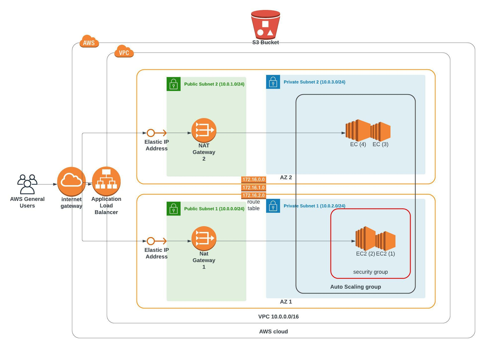

# AWS Cloudformation Udagram
<!-- START doctoc generated TOC please keep comment here to allow auto update -->
<!-- DON'T EDIT THIS SECTION, INSTEAD RE-RUN doctoc TO UPDATE -->
**Table of Contents**  

- [Description](#description)
- [Aws Cloud Architecture](#aws-cloud-architecture)
- [Project Architecture explained](#project-architecture-explained)
- [Installation Prerequisites](#installation-prerequisites)
- [Installation](#installation)

<!-- END doctoc generated TOC please keep comment here to allow auto update -->


### Description
In this project I deploy web servers for a highly available web app using CloudFormation


### Aws Cloud Architecture


---
### Project Architecture explained

- In this project we install an apache web server in a high availability mode we have 4 subnets under the same VPC (2 public subnets) and (2 private subnets).
web servers are deployed in the private subnets and can access public internet via nat gateways deployed on the public subnets.

- Load balancer route the traffic to the web servers through the public subnets 

--- 

### Installation Prerequisites
to be able to install this project you should have:

- AWS account
- AWS cli installed on you machine

### Installation

to deploy this project on aws cloud

```bash 
# create network architecture for the project
./create.sh <stackname-network> network.yaml network-params.json 

# create web servers for the project

./create.sh <stackname-webservers> webservers.yaml webservers-params.json
```
you can replace the stackname with any name you desire

if you wish to delete the stack after testing it

```bash
# delete network setup for the project
./delete.sh <stackname-network>

#delete webservers for the project

./delete.sh <stackname-webservers>
```
